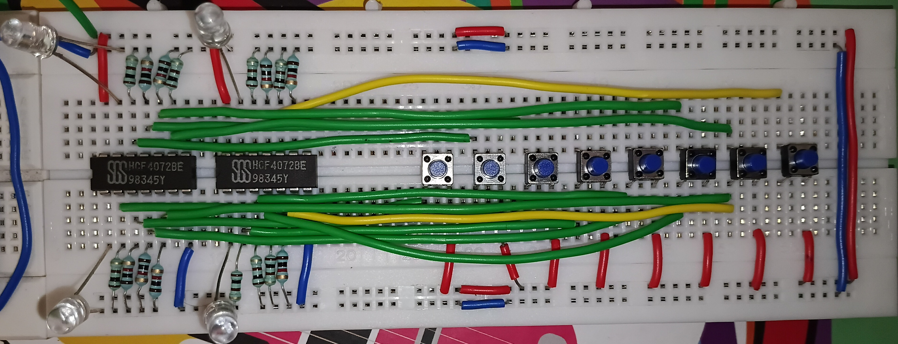

# Equality-Checker
## MODULE 1: THE BINARY CODED DECIMAL (BCD) ENCODER
### Bill of Materials
- DUAL 4 INPUT OR GATES (74LS75)
- Push Buttons
- Blue LED's
- Pull Down Resistors (10K)
- A Hella Lot of Wires

Check out the 'bcd_schematics' folder for the schematics !!!

